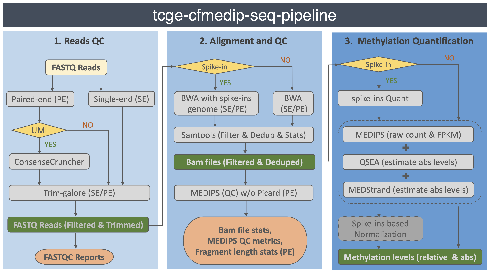

# TCGE cfMeDIP-seq pipeline

## Intoduction

The Cancer Genetics and Epigenetics (TCGE) program cfMeDIP-seq pipeline is designed for automated end-to-end quality control and processing of cfMeDIP-seq and MeDIP-seq data. The pipeline was developed with [Snakemake](https://snakemake.readthedocs.io/en/stable/index.html), which will automatically deploy the execution environment. The pipeline can be run on compute clusters with job submission engines as well as on stand along machines. The pipeline starts from the raw FASTQ files all the way to quality metrics and methylation quantification/estimation matrixes. The pipeline supports both signle-end and paired-end sequencing data with or without spike-in/UMI sequences. The pipeline can be applied to individual sample, as well as to aggregate multiple samples' to create matrixes of QC metrics; fragment profiles and methylation quantifications.

The pipeline was developed by [Yong Zeng](mailto:yzeng@uhnresearch.ca) based on some prior work of Wenbin Ye, [Eric Zhao](https://github.com/pughlab/cfMeDIP-seq-analysis-pipeline). The pipeline is available on [COBE](https://www.pmcobe.ca/pipeline/624d0bb4002b11003426f7d8) as well.


### Features

- **Portability**: The pipeline run can be performed across different cluster engines such as SLURM (tested). For other platforms, please refer to [here](https://snakemake.readthedocs.io/en/stable/executing/cluster.html).
- **Supported genomes**: We provide genome database, which includes aligner indices and black list, downloader for human hg38, hg19 and along with Arabidopsis thaliana genome TAIR10. In addition, spike-in fasta sequences for two BACs: [F19K16](https://www.arabidopsis.org/servlets/TairObject?type=assembly_unit&id=362) from Arabidopsis Chr1 and [F24B22](https://www.arabidopsis.org/servlet/TairObject?type=AssemblyUnit&name=F24B22) from Arabidopsis Chr3, and [sytheticDNAs](https://github.com/hoffmangroup/2020spikein) were enclosed in `data/SyntheticDNA_Arabidopsis_BACs.fa`. You can also build genome database from FASTA for your custom genomes.


### How it works
This schematic diagram shows you how pipeline works:



## Installation

1) Make sure that you have a Conda-based Python3 distribution. The recommended choice is [Mambaforge](https://github.com/conda-forge/miniforge#mambaforge). In case you don't use Mambafore, you can always install [Mamba](https://github.com/mamba-org/mamba) into any other Conda-based Python distribution with:

	```bash
	$ conda install -n base -c conda-forge mamba
	```

2) Git clone this pipeline.
	```bash
	$ cd
	## token request for private repository
	$ git clone https://github.com/yzeng-lol/tcge-cfmedip-seq-pipeline
	```

3) Install pipeline\'s core enviroments
	```bash
	$ cd tcge-cfmedip-seq-pipeline
	$ conda activate base
	$ mamba env create --file conda_env.yaml
	```

4) Test run
	> **IMPORTANT**: sub envs will be created during the test run.

	```bash
	$ conda activate tcge-cfmedip-seq-pipeline
	$ cd tcge-cfmedip-seq-pipeline

  ## Prepare reference file and INPUT sample(s) info file
	## template provided for testing, PATHs changes needed
  $ vim ./test/data/Reference/test.tsv
	$ vim ./test/data/sample_pe.tsv

  ## Prepare config yaml file according to the template
	## PATHs changes needed for testing
  $ mkdir ../tcge-cfmedip-seq-pipeline-test-run
	$ cp ./workflow/config/config_template.yaml ../tcge-cfmedip-seq-pipeline-test-run/config_testrun.yaml
	$ vim ./workflow/config/config_template.yaml

	## run with the internet connection as well
	## !! extra environments will be installed to tcge-cfmedip-seq-pipeline-sub
	## !! it will be killed in rule meth_qc_quant, which is fine and due to current test dataset.
	$ snakemake --snakefile ./workflow/Snakefile \
	            --configfile ../tcge-cfmedip-seq-pipeline-test-run/config_testrun.yaml \
		    --conda-prefix ${CONDA_PREFIX}-sub \
	            --use-conda --cores 4 -p
	```

5) Run on HPCs

	You can submit this pipeline on clusters after editing ./workflow/sbatch_snakemake_template.sh according different resource management system. More details about cluster configuration can be found at [here](https://snakemake.readthedocs.io/en/stable/executing/cluster.html). For example:

	```bash
	## template is based on SLURM
	$ vim ./workflow/sbatch_snakemake_template.sh
	$ sbatch ./workflow/sbatch_snakemake_template.sh
	```

## Input files specification

### Download reference genome data
You can download reference genome, pre-build BWA index and annotated regions, such as the blacklist, from ENCODE for hg38 and hg19 via following command line. The manifest file hg38/hg19.tsv will be generated accordingly. Currently, the ENCODE black list and bwa index are mandatory for the manifest file, which you can also create it based on `workflow/config/hg38_template.tsv` with existing data.

```bash
## eg: ./download_build_reference.sh hg38 /your/genome/data/path/hg38
$ ./download_reference.sh [GENOME] [DEST_DIR]
```

### Build reference genomes index
If your sequencing libraries come with spike-ins, you can build new aligner index after combining spike-in genome with human genome. The new index information will be appended to corresponding manifest file.

```bash
## eg: ./build_reference_index.sh hg38 ./data/BAC_F19K16_F24B22.fa hg38_BAC_F19K16_F24B22 /your/genome/data/path/hg38
$ ./build_reference_index.sh [GENOME] [SPIKEIN_FA] [INDEX_PREFIX] [DEST_DIR]
```

### config file for input samples
> **IMPORTANT**: READ THROUGH THE GUIDE INFORMATION IN THE TEMPLATE TO MAKE A CORRECT CONFIG FILE. ESPECIALLY FOR SAMPLES WITH SPIKE-IN CONTROL AND/OR UMI BARCODES.

1) A config YAML file specifies all the input parameters and files that are necessary for successfully running this pipeline. This includes a specification of the path to the genome reference files. Please make sure to specify absolute paths rather than relative paths in your config files. The template can be found at [here](./workflow/config/config_template.yaml)

2) The samples's sequence data table template. Note:Prepare the table for single-end and paired-end samples separately and use exactly same table `header`, if there are multiple lanes, use comma to separate the list.

|	sample_id   |     R1	     |  R2(p.r.n.)|
|-------------|--------------|------------|
|  A	|  full/path/to/A_L001_R1.fq.gz |                              |
|  B	|  full/path/to/B_L001_R1.fq.gz | full/path/to/B_L001_R2.fq.gz |
|  C  |  path/C_L001_R1.fq.gz,path/C_L002_R1.fq.gz | path/C_L001_R2.fq.gz,path/C_L002_R2.fq.gz  |
