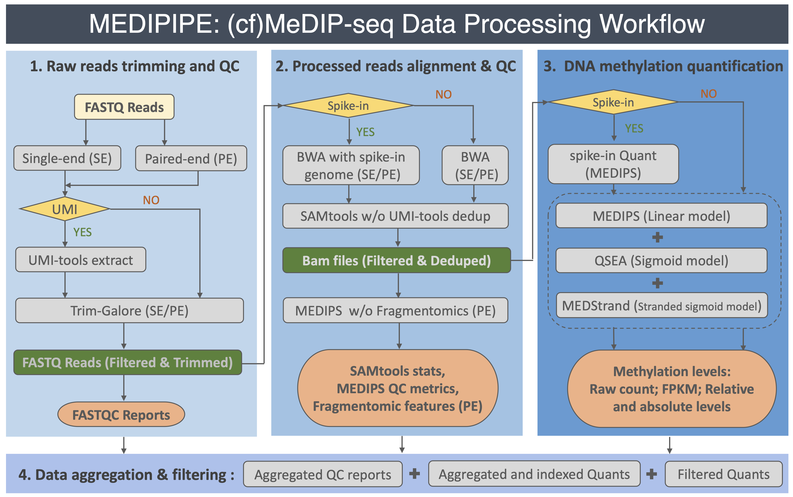

# MEDIPIPE: (cf)MeDIP-seq Data QC and Analysis Pipeline (v1.0.0)

## Intoduction
The MEDIPIPE is designed for automated end-to-end quality control (QC) and analysis of (cf)MeDIP-seq data. The pipeline starts from the raw FASTQ files all the way to QC, alignment, methylation quantifications and aggregation. The pipeline was developed by [Yong Zeng](mailto:yzeng@uhnresearch.ca) based on some prior work of Wenbin Ye, [Eric Zhao](https://github.com/pughlab/cfMeDIP-seq-analysis-pipeline).

### Features
- **Portability**: MEDIPIPE was developed with [Snakemake](https://snakemake.readthedocs.io/en/stable/index.html), which will automatically deploy the execution environments. It can also be performed across different cluster engines (e.g. SLURM) or stand-alone machines.
- **Flexibility**: MEDIPIPE can deal with single-end or paired-end reads, which comes along with or without spike-in/UMI sequences. It can be applied to individual samples, as well as to aggregate multiple samples from large-scale profiling.

### How it works
This schematic diagram shows you how pipeline works:



## Installation
1) Make sure that you have a Conda-based Python3 distribution(e.g.,the [Miniconda](https://docs.conda.io/en/latest/miniconda.html)). The installation of [Mamba](https://github.com/mamba-org/mamba) is also recommended:

	```bash
	$ conda install -n base -c conda-forge mamba
	```

2) Git clone this pipeline.
	```bash
	$ cd
	$ git clone https://github.com/yzeng-lol/MEDIPIPE
	```

3) Install pipeline\'s core enviroment
	```bash
	$ cd MEDIPIPE
	$ conda activate base
	$ mamba env create --file conda_env.yaml
	```

4) Test run
	> **IMPORTANT**: EXTRA ENVIRONMENTS WILL BE INSTALLED, MAKE SURE YOU STILL HAVE INTERNET ACCESS.
	* **Step 1:** Prepare reference, samples FASTQ and aggregation files according to [templates](./test/README.md).
	* **Step 2:** Specify input configuration file by following the instructions [here](./test/README.md).
	* **NOTE:** For testing run, you can simply run the SED command below to specify files in Step1,2. The outputs can be found in ./test/Res. The pipeline will be killed for the methylation quantification due to the current testing dataset, which is fine for moving to real dataset.

	```bash
    $ sed -i 's,/path/to,'"$PWD"',g' ./test/*template.*
	$ conda activate MEDIPIPE
	$ snakemake --snakefile ./workflow/Snakefile \
	            --configfile ./test/config_template.yaml \
		    --conda-prefix ${CONDA_PREFIX}_extra_env \
	            --use-conda --cores 4 -pn
	```

5) Run on HPCs

	You can also submit this pipeline to clusters with the template ./workflow/sbatch_Snakefile_template.sh. This template is for SLURM, however, it could be modified to different resource management systems. More details about cluster configuration can be found at [here](https://snakemake.readthedocs.io/en/stable/executing/cluster.html).

	```bash
	## Test run by SLURM submission
	$ sed -i 's,/path/to,'"$PWD"',g' ./workflow/sbatch_Snakefile_template.sh    # replace PATHs for testing
	$ sbatch ./workflow/sbatch_Snakefile_template.sh
	```

## Assets and Troubleshooting
There are several scripts are enclosed in the folder [assets](./assets/README.md), allowing you to download/build reference index and manifest table, to fogre BSgeome package for spike-in controls, to filter regions for fragment profiling calculation. Please also see [this document](./assets/Troubleshooting.md) for troubleshooting. I will keep updating this document for errors reported by users.
