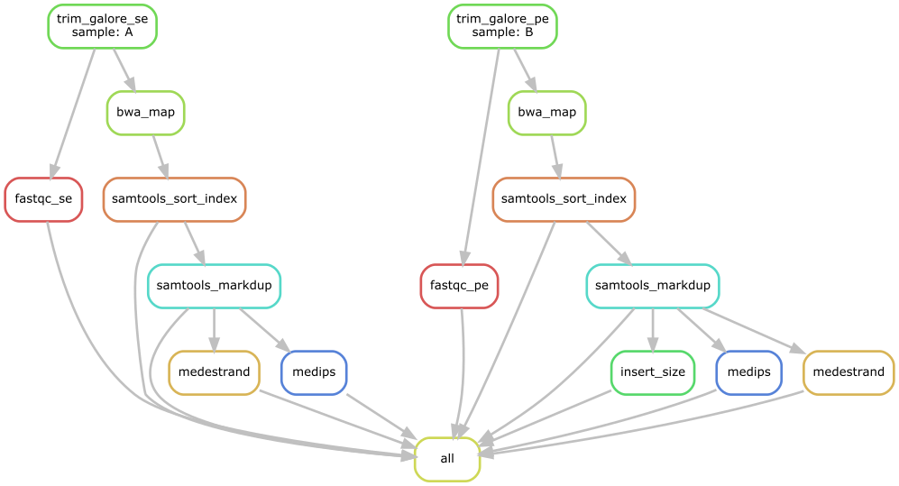

# TCGE cfMeDIP-seq pipeline

## Intoduction

This pipeline is designed for automated end-to-end quality control and processing of cfMeDIP-seq and MeDIP-seq data. The pipeline was developed with [Snakemake](https://snakemake.readthedocs.io/en/stable/index.html), which will automatically deploye the execution enviroment. The pipeline can be run on compute clusters with job submission engines as well as on stand along machines. The pipeline starts from the raw FASTQ files all the way to QC matirx and signal track generation. The pipeline supports both signle-end and paired-end data. The outputs produced by the pipeline include 1) formatted HTML QC reports, 2) enrichment signal tracks, 3)...

The pipeline were developed in collaboration with ###, ###, ..

### Features

- **Portability**: The pipeline run can be performed across different cluster engines such as SLURM, SGE and PBS.
- **Supported genomes**: We provide genome database, which includes aligner indices and black list, downloader for hg38, hg19, hg38+tair10 and hg19+tair10. You can also build genome database from FASTA for your costom genome.

### How it works
This is schematic diagram shows you how pipeline works:



## Installation

1) Make sure that you have a Conda-based Python3 distribution. The recommended choice is [Mambaforge](https://github.com/conda-forge/miniforge#mambaforge). In case you don't use Mambafore, you can always install [Mamba](https://github.com/mamba-org/mamba) into any other Conda-based Python distribution with:
	```bash
	$ conda install -n base -c conda-forge mamba
	```

2) Git clone this pipeline.
	```bash
	$ cd
	## token request for private repository
	$ git clone https://github.com/yzeng-lol/cfmedip-seq-pipeline

3) Install pipeline\'s Conda enviroments
	```bash
	$ cd cfmedip-seq-pipeline
	$ conda activate base
	# It might take a while to download and instal the core environment
	$ mamba env create --file conda_env.yaml

	# Install sub enviroments
	$ conda activate cfmedip-seq-pipeline
	$ snakmake
	```

4) Test run
	```bash
	## run on local
	$ snakemake --snakefile /cluster/home/yzeng/snakemake/cfmedip-seq-pipeline/workflow/Snakefile \
	          --configfile /cluster/home/yzeng/snakemake/cfmedip-seq-pipeline/workflow/config/config_pe_template.yaml \
	          --use-conda  --conda-prefix /cluster/home/yzeng/miniconda3/envs/cfmedip-seq-pipeline_R \
	          --cores 4 -p

	## submit to SLURM cluster
	$ sbatch /cluster/home/yzeng/snakemake/cfmedip-seq-pipeline/workflow/sbatch_snakemake_template.sh
  ```

## Input file spefification

....
